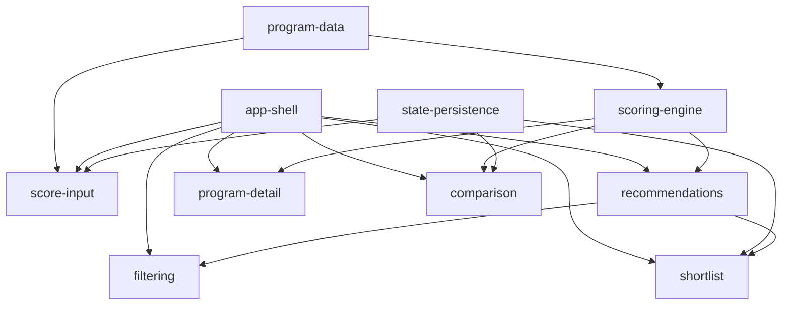

# MVP capability plan

Signed-off delivery plan for Prokhidnyi MVP. Maps every **MVP** functional
requirement in [`requirements.md`](requirements.md) to exactly one OpenSpec slice
(`add-<capability>`). Cross-cutting NFR/TC/BC constraints are listed separately and
honored by every UI slice via `app-shell`.

**Status:** shipped (all 10 slices archived 2026-07-03).

---

## Slicing principles

1. **One cohesive capability per slice** — each slice is independently spec'd,
   tested, reviewed, and archived.
2. **Dependency-respecting order** — foundations before features; engine before UI
   that consumes it.
3. **One FR owner per slice** — no gaps, no duplicate owners in the coverage table
   below. View-specific empty states (`FR-UX-01`) are implemented in multiple
   components but owned by `recommendations` (primary list surface).
4. **Cross-cutting constraints travel** — NFR/TC/BC ids are cited in specs and
   honored at implementation time; they do not need a dedicated slice.

---

## Slice table

| Slice (`add-*`) | OpenSpec capability | FRs owned | NFRs / constraints carried | Depends on | Parallel-safe |
|---|---|---|---|---|---|
| `add-program-data` | `program-data` | — (data foundation) | TC-DATA-01, BC-HONESTY-01 | — | yes (with app-shell) |
| `add-app-shell` | `app-shell` | — (foundation) | NFR-RESP-01, NFR-A11Y-01, BC-LANG-01, TC-STACK-01, TC-PLATFORM-01, BC-DEADLINE-01, BC-HONESTY-01 | — | yes (with program-data) |
| `add-scoring-engine` | `scoring-engine` | FR-SCORE-01, FR-SCORE-02, FR-SCORE-03 | NFR-PERF-01, BC-HONESTY-01 | program-data | no |
| `add-state-persistence` | `state-persistence` | FR-STATE-01 | TC-STORAGE-01, NFR-PRIV-01, BC-PRIVACY-01 | — | yes (Wave 1) |
| `add-score-input` | `score-input` | FR-INPUT-01, FR-INPUT-02, FR-INPUT-03 | NFR-PERF-01, NFR-A11Y-01, FR-STATE-01 | program-data, state-persistence, app-shell | no |
| `add-recommendations` | `recommendations` | FR-UX-01 | FR-SCORE-02, FR-SCORE-03 (render), NFR-A11Y-01, BC-HONESTY-01 | scoring-engine, program-data, app-shell | no |
| `add-filtering` | `filtering` | FR-FILTER-01, FR-FILTER-02 | NFR-PERF-01, NFR-A11Y-01, FR-UX-01 (filter empty) | recommendations | yes (after recommendations) |
| `add-program-detail` | `program-detail` | FR-DETAIL-01 | BC-HONESTY-01, NFR-A11Y-01 | scoring-engine, program-data, app-shell | yes (Wave 3) |
| `add-comparison` | `comparison` | FR-COMPARE-01 | NFR-A11Y-01 | scoring-engine, program-data, state-persistence, app-shell | yes (Wave 3) |
| `add-shortlist` | `shortlist` | FR-LIST-01, FR-LIST-02 | FR-STATE-01, FR-UX-01 (list empty), NFR-A11Y-01 | state-persistence, recommendations, app-shell | yes (Wave 3) |

---

## Dependency graph

**Critical path:** `program-data` → `scoring-engine` → `score-input` →
`recommendations` (enter scores → see chances).

**Parallelizable after Wave 2:** `program-detail`, `comparison`, `shortlist`
(disjoint UI modules).

---

## Build waves

| Wave | Slices | Outcome |
|---|---|---|
| 0 | program-data, app-shell | Dataset + Ukrainian design-system shell |
| 1 | scoring-engine, state-persistence, score-input | Pure model + persisted profile inputs |
| 2 | recommendations, filtering | Primary list flow (US-1, US-2, US-3) |
| 3 | program-detail, comparison, shortlist | Deep-dive, compare, save/track (US-4, US-5) |

---

## FR coverage check

| FR | Owner slice | Spec |
|---|---|---|
| FR-INPUT-01 | add-score-input | `openspec/specs/score-input/spec.md` |
| FR-INPUT-02 | add-score-input | `openspec/specs/score-input/spec.md` |
| FR-INPUT-03 | add-score-input | `openspec/specs/score-input/spec.md` |
| FR-FILTER-01 | add-filtering | `openspec/specs/filtering/spec.md` |
| FR-FILTER-02 | add-filtering | `openspec/specs/filtering/spec.md` |
| FR-SCORE-01 | add-scoring-engine | `openspec/specs/scoring-engine/spec.md` |
| FR-SCORE-02 | add-scoring-engine | `openspec/specs/scoring-engine/spec.md` |
| FR-SCORE-03 | add-scoring-engine | `openspec/specs/scoring-engine/spec.md` |
| FR-DETAIL-01 | add-program-detail | `openspec/specs/program-detail/spec.md` |
| FR-COMPARE-01 | add-comparison | `openspec/specs/comparison/spec.md` |
| FR-LIST-01 | add-shortlist | `openspec/specs/shortlist/spec.md` |
| FR-LIST-02 | add-shortlist | `openspec/specs/shortlist/spec.md` |
| FR-STATE-01 | add-state-persistence | `openspec/specs/state-persistence/spec.md` |
| FR-UX-01 | add-recommendations | `openspec/specs/recommendations/spec.md` |

**Totals:** 14 / 14 MVP FRs assigned. 0 gaps. 0 duplicate owners.

Deferred (not MVP): FR-LIST-03 (`deadline-reminders`), FR-SEARCH-01 (`program-search`).

---

## Per-slice definition of done

Each slice is done when: OpenSpec change validated (`openspec validate --strict`),
tasks.md fully ticked, tests with `@trace` annotations green, `review-gate` clean
(`review-findings.json`), `Slice:` commit trailer present, delta synced to baseline
and archived under `openspec/changes/archive/`.
